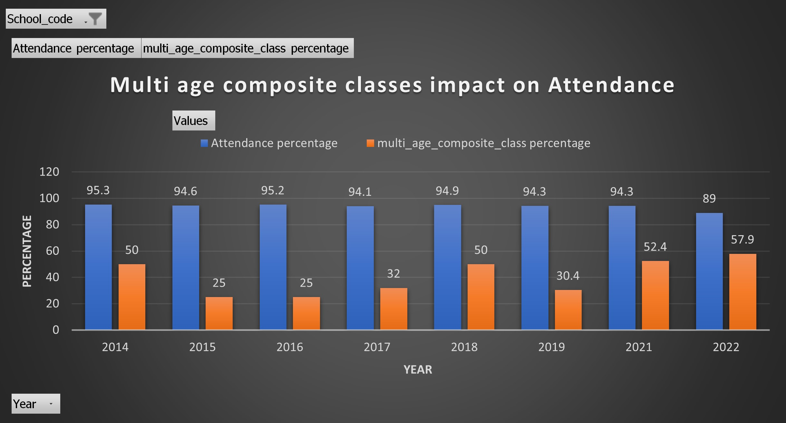

# New South Wales Department of Education (NSW DOE) - Data Case Study 🦘

# The Case Study

## Step 1 - Download required CSVs data in the data folder of Codespace 

**Run below commands in the Terminal of Codespace and it will download csv data into the data folder**

@chughprakriti ➜ /workspaces/nsw_doe_data_case_study (main) $ https://data.cese.nsw.gov.au/data/dataset/68b47d34-a014-4345-b41c-c97b8b58aca3/resource/0f88215b-b838-4357-a264-6b83120065ba/download/2022-attendance-data-final.csv -O ./data/2022-attendance-data-final.csv

@chughprakriti ➜ /workspaces/nsw_doe_data_case_study (main) $ https://data.cese.nsw.gov.au/data/dataset/8451d297-3fb0-4904-8722-f72736851b3b/resource/30dd6e15-2333-427c-9952-9b7a2190ded0/download/2022-multi-age_composite-classes-final.csv -O ./data/2022-multi-age_composite-classes-final.csv

## Step 2 - Create Tables in DB and ingest the data by runnig Below commands 

CREATE TABLE main.attendance_data_final_2022 AS SELECT * FROM read_csv_auto('data/2022-attendance-data-final.csv');

CREATE TABLE main.multi_age_composite_classes_final_2022 AS SELECT * FROM read_csv_auto('data/2022-multi-age_composite-classes-final.csv');

**Alternate to above two commands you can trigger this SQL script(/workspaces/nsw_doe_data_case_study/modelling/table_creation_query.sql)**

## Step 3 - Unpivot the data tables by running below SQL Scripts

**Step 3.1** - Trigger SQL Script(**/workspaces/nsw_doe_data_case_study/modelling/unpivot_attendance_data_query.sql**) and it will generate Unpivot dataset for Attendance table. 

**Step 3.2** - Trigger SQL Script(**/workspaces/nsw_doe_data_case_study/modelling/unpivot_multi_age_query.sql**) and it will generate Unpivot dataset for Multi Age Composite Classes table. 

## Step 4 - Model the data and Create Final Data Mart for Analysis

Trigger SQL Script(**/workspaces/nsw_doe_data_case_study/modelling/finaldatamart_query.sql**) and it will Prepare final Data mart for Analysis purpose.

## Step 5 - Completed data analysis in the Jupytor Notebook(/workspaces/nsw_doe_data_case_study/analysis/analysis-jupyter/example.ipynb) by applying filter on one School and by downloading the CSV extracts in the local desktop.

**Findings Below**:

**2022-attendance-data-final**
-> school_code has Null/Blank value for school_name = "NSW government".
-> Data for Year 2020 is missing. 
-> There are some Junk Values like "na","sp",Nulls in all the Years columns.
-> Needs to apply Unpivoting to convert all the years columns into raws.

**2022-multi-age_composite-classes-final**
-> There are some Null Values in the fields related to COMPOSITE Classes.
-> Data for Year 2020 is missing and no data prior to 2014. 
-> Needs to apply Unpivoting to convert all the Composite class columns into raws and extracting Years from the Composite class columns.

## Step 6 - Exported CSV of FinalDataMart table in local desktop and generated PIE Chart report.

Uploaded Excel file named as FinalDataMart_Extract for exported data and PIE chart under ./analysis/ Folder.

Screen shot of the PIE Chart below for one of the school where school_code = 1001.

